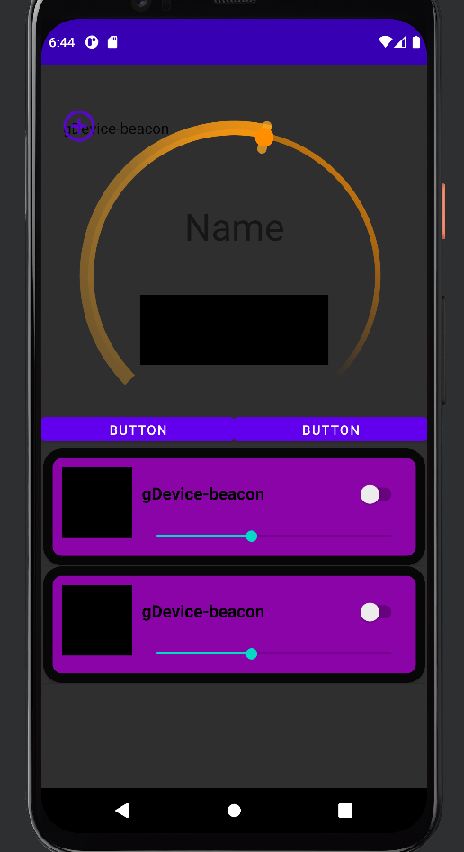
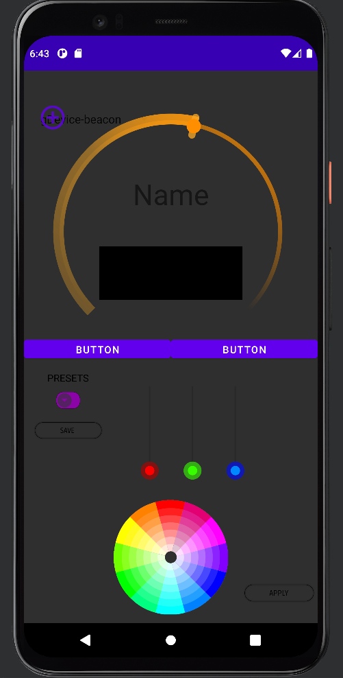

# LightConnectApp
##This app is currently under developlment##

# Info  

This app was created to be a RGB lightstrip color picker using Bluetooth Low Energy or Classic transmission. Accompanying the app is code for an Arduino or ESP based micro that enables the micro the connect and communicated in real time with the app.  For Bluetooth classic operation please use the initial commit (sorry about the UI). For BLE the most recent commit is correct.  
# Current UI Images

# App Features  

  ## Bluetooth 

    BLE and Classic connection and communication  

    Setup for finding devices with pre-defined service and characteristic UUID’s 

    Read and write functions  

    Interrupts  

    Permission requests and handling 

  ## MySQL 

    MySQL non-volatile database  

    Nested inside custom dropdown menu 

    User defined table entries with name and RGB color code R, G, B (dynamically retrieved from the current color displaying on device) 

 

